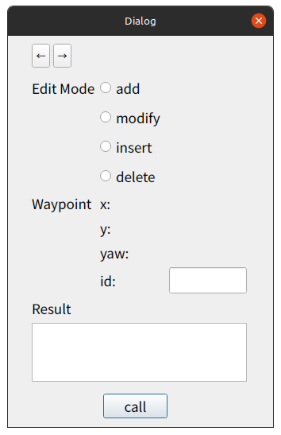
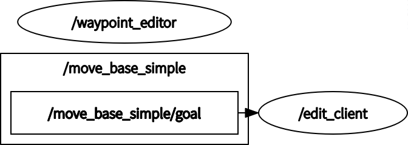

# waypoint_editor_ros

[](https://opensource.org/licenses/MIT)

The ROS package of waypoint editing tool

<p align="center">
  
</p>

## Features
### Edit the waypoint
- add
  - Add a waypoint to the end of the list
  - No need for ID
  - Need for the goal pose ("2D Nav Goal" in rviz)
- modify
  - Modify the waypoint
  - Need for ID
  - Need for the goal pose ("2D Nav Goal" in rviz)
- insert
  - Insert a waypoint
  - Need for ID
  - Need for the goal pose ("2D Nav Goal" in rviz)
- delete
  - Delete the waypoint
  - Need for ID
  - No need for the goal pose
### Undo/Redo
- undo
  - Click on "←" button
  - Undo the editing the waypoint
- redo
  - Click on "→" button
  - Redo the editing the waypoint
### ID
- The ID of the waypoint is automatically assigned
- If you delete a waypoint, the ID will be reassigned


## Environment
- Ubuntu 20.04
- ROS Noetic

## Dependencies
- [waypoint_manager_ros](https://github.com/ToshikiNakamura0412/waypoint_manager_ros.git)

## Install and Build
```
# clone repository
cd /path/to/your/catkin_ws/src
git clone https://github.com/ToshikiNakamura0412/waypoint_editor_ros.git

# build
cd /path/to/your/catkin_ws
rosdep install -riy --from-paths src --rosdistro noetic # Install dependencies
catkin build waypoint_editor_ros
```

## How to use
```
roslaunch waypoint_editor_ros waypoint_editor.launch
```

## Running the demo
```
roslaunch waypoint_editor_ros test.launch
```

<p align="center">
  
</p>

## Node I/O


## Nodes
### waypoint_editor
#### Service Topics
- ~\<name>/edit_waypoint
  - Edit the waypoint
- ~\<name>/redo_waypoint
  - Redo editing the waypoint
- ~\<name>/undo_waypoint
  - Undo editing the waypoint

#### Parameters
- ~\<name>/<b>waypoint_file</b> (str, default: `waypoints.yaml`):<br>
  The file path of waypoints

### edit_client
#### Subscribed Topics
- /move_base_simple/goal (`geometry_msgs/PoseStamped`)
 - The goal pose
